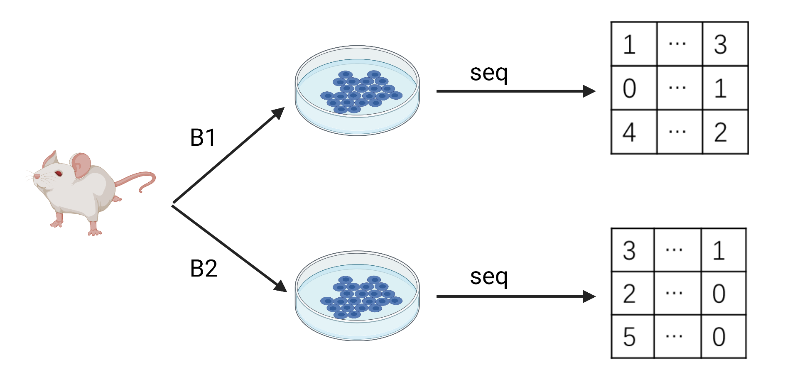
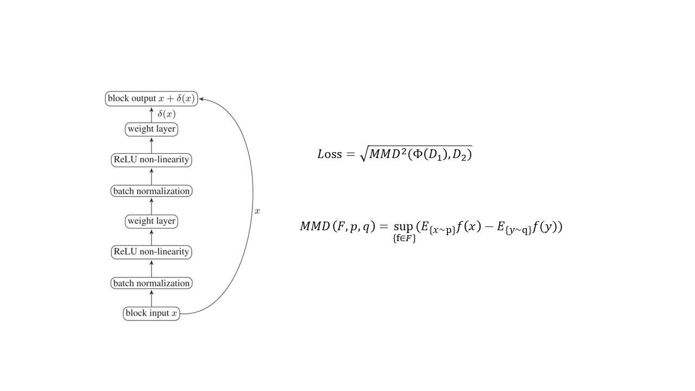
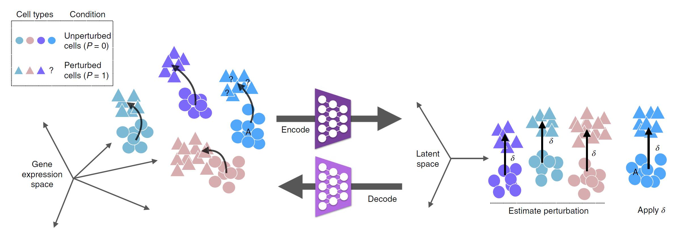
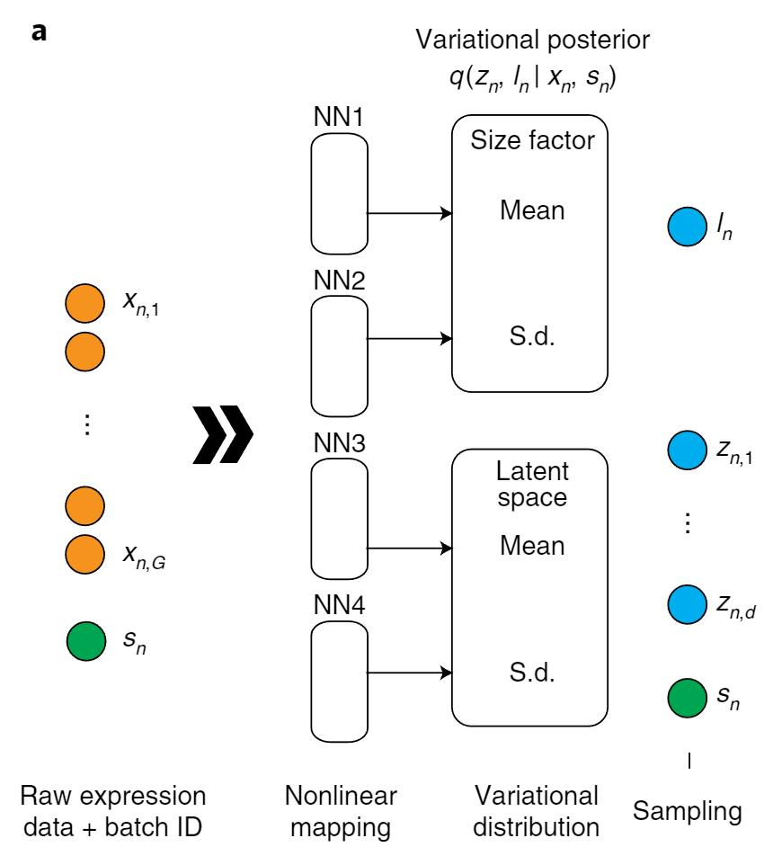
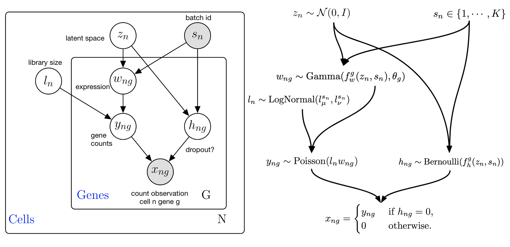
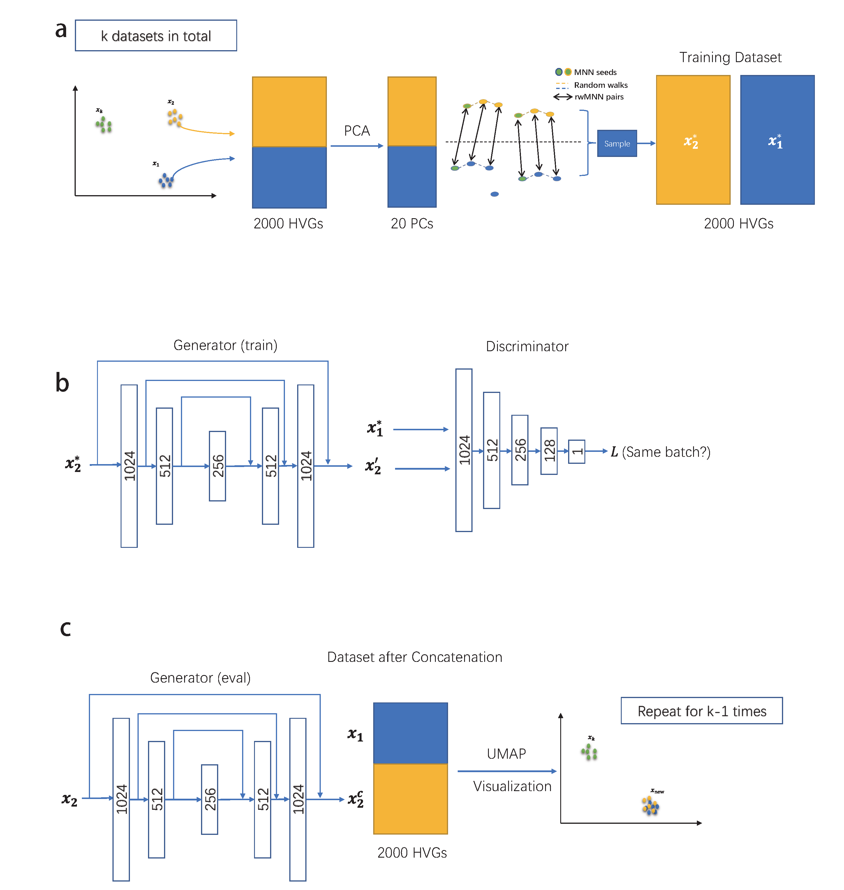

# When deep learning meets single-cell data with batch effect

The advancement of single-cell RNA sequencing (scRNA-seq) technologies and the vast amounts of data generated has contributed significantly to biological research, but one major problem in the single-cell data area is the existance of batch effect. Batch effect can be interpreted as the unacceptably different scale in the single-cell data from different batch but same tissue [1] (see Figure 1 for a simple example, and B1/B2 represents different scRNA-seq data). The reasons of batch effect are various, including experiment techniques (major), time, temperature, etc. If we cannot remove the batch effect in the data we have, we will lose the opportunity to find more value in our single cell data with batch information. We always call the process for reducing batch effect as __batch effect corection__.

Figure 1

The target of the tools for batch effect correction can be classified into two tracks: 1. Correct problemistic data based on the original gene expression space and 2. Correct the problemistic data based on embedding space. In the past few years, some researchers focused on using probability model [2], non-negative matrix decomposition [3] and alignment based on linear models [4] to remove the batch effect in the given datasets. However, as single-cell sequencing technology advances, the amount of data we can access is becoming larger and larger. The above methods rely on the powerful CPU of the computer to complete the computation, but some of them can even exceed the upper limit of high performance computing center in terms of running time [5]. Also, the assumptions for batch effect models are challenged. 

In the original assumption [6], the gene expression we sequenced $Y$ is the linear combination between the true gene signals $X$ and batch effect $B$, that is:

$Y = AX+B$

In this equation, $A$ is a scaling factor. Our target here is to solve $X$ based on the model. However, the change of batch effect on gene expression may not be linear, and even sometimes acts on the real gene signals. For example, for the same kinds of cells, if they are sequenced from different tissues (like lung and heart), the difference in the results should be expected [7]. For the gene expression of same cells but in patients or healthy people, the results can also in divergence. Therefore, this is an unreasonable assumption.

We now tend to use a more complex mathematical language to describe single-cell gene expression, which is known as manifold. Single cell data from the same tissue are essentially distributed in different parts of the same manifold structure. Therefore, we can understand the batch effect as a difference in position and align the data by deep learning with neural networks, which can perform the similar work in image style transfer or text2image transfer. Therefore, we can define our target for batch effect correction as: Alignment of cells from different batches but of the same cell type mapped into the same space (We have this definition now, which is easier to understand. However, I will refine it later, based on another work).

In this blog, I will present three interesting models based on deep learning technique to remove the batch effect exisiting in the single cell RNA sequencing (scRNA-seq) data. 

## 1. MMD-ResNet

Maximum mean discrepancy (MMD) -ResNet [8] is one of the earliest models that tries to solve batch effect problem base on neural networks. Assume we have two scRNA-seq datasets $D_1$ and $D_2$, and we can evaluate the quality of different datasets based on the variance of the gene expression across different samples or the the depth of sequencing. Here MMD-ResNet chooses to utilize the dataset with better quality as the anchor and match the data from another dataset to its space. To match the given data, we need two important parts: distance and matching function. To define the distance, this model utilizes MMD, which is known as a metric we use to evaluate the distance between to distributions, to quantify the difference between the output of the matching function and the target dataset. For the matching function, since neural networks can nearly fit arbitary functions, so MMD-ResNet used neural network as its matching function (see Figure 2 for its structure). It is interesting that the authros use the resuial network, which is a very tricky method coming from Computer Vision area, for people who intend to explore the concepts behind this design, we recommend these two well-written papers to you: [9][10]

Figure 2

## 2. scGen

scGen [11] is also a deep learning based model but using different structures and training strategies. From the figure 3 given by the authors, scGen is a model based on Varitional Auto-encoder (VAE) [12] with latent space arithmetics. It seems very complicated, but the main idea of this method is very simple, that is, correct the batch effect in the latent space then perform the inverse projection to the original gene expression space.

For the first part of this model, the author uses an encoder (a type of neural network which can perform the dimension reduction) to compress the original gene expression data into another space with lower dimensions, and in the latent space, we can observe the difference among different batches. Therefore, the next question is how to model this difference, which is defined as $\delta$ vector in this paper. To estimate the $\delta$ vector, scGen utilizes the the difference of average between two batches in the latent space, that is: 

$\delta = avg(z_1) - avg(z_2)$

And apply this differnce to $z_2$. Therefore, we can correct the batch effect in the latent space. The last step is an inverse projection function, which means that we can use a decoder (a type of neural network which can recover the data after dimension reduction to its original space) and finsh the batch correction process.

There are many types of neural networks with encoder-decoder structure, but VAE maybe the most famous one in computational biology area. If you are interested in VAE, we recommend these two papers to you: [12], [13]

Figure 3

## 3. scVI
scVI [14] is also a VAE-based model, but it excels in its good scalability and in the selection of the distribution of the input data used for modeling. scVI utilize different distribution to represent the input scRNA-seq data and using encoder model to transfer the data in gene expression space to a common latent space with batch information. The construction of the latent space can be represented as a joint distribution. After scVI finishes the inference process, we can also utilize the output of the decoder to generate a new gene expression space without batch effect. The most common distribution we used to model the scRNA-seq data is the Zero Inflated Negative Bionmial (ZINB) ditribution because this distribution fits better with sparse data. The inference process is shown in figure 4, while the generative process is shown in figure 5.

Figure 4

Figure 5

## 4. ResPAN

Here we rearch our last stop, ResPAN [5], which is a model based on random walk sampling and adverserial training policy working for reducing the batch effect in current scRNA-seq data. The structure of this model is shown in figure 6. The idea of this model coming from Generative adverserial network (GAN) [15]. GAN is a class of generative model that consists of a generator and a discriminator, whose main purpose is to generate data from data that obeys distribution A to data that obeys distribution B according to some conditions. Minimizing the loss of the generator will make the output of the generator closer and closer to the true distribution, while maximizing the loss of the discriminator will confuse it and affect the generator's judgment of the degree of sample approximation. The output of the two substructures at the end of the training will reach an equilibrium. Few researchers would choose to use GAN to reduce batch effect, even though the main task it is responsible for is very similar to the goal of batch correction. One of the reasons is that the training process of GAN is very difficult. However, the generative ability of GAN is undoubted, we will see it later.

Figure 6

To correct the scRNA-seq data with multi-batches, the first step of ResPAN is to rearrange the sequence of training based on the gene expression variation in differnet batches. The second step is generating the training dataset. ResPAN creates the training dataset based on the mutual nearest neighbors pairs strenghened by random walk on kNN graph. Such a sampling strategy is based on the degree of similarity of gene expression. After obtaining the training set, in the third step, ResPAN uses WGAN-GP (a well-known variant of GAN that optimizes the error function to make the model training much less difficult) to complete the optimization, and the output of generator to obtain the result of batch effect correction on the gene expression space. 

Actually, ResPAN not only contributes a solution to the problem, but also in turn optimizes the problem definition. At the beginning of this blog, we defined the batch effect in terms of pure data science, but it is not suitable for the final version. The existence of batch effect ultimately affects the analysis of biological information, so we need a more practical and complete definition. Happily, [7] gives a very good response. It defines the batch effect correction problem from two perspectives, including batch perspective and biological perspective:

1. For batch perspective, reducing batch effect means data from different batch should be aligned or integrated uniformly, and the ratio is based on the number of cells contained in different batches.

2. For the biological perspective, reducing batch effect means preserving the biological information, including cell type distribution, pseudotime distribution and cell cycle distribution, etc. The order and correspondence of biological information should not be disturbed after the integration, but should be consistent with that before the integration.

ResPAN is the first method developed for batch effect correction based on this definition, advocating this reasonable definitation. However, we believe that it must not be the last model that focuses on solving the problem and will not be the best model in both directions. Although the field has become very competitive, the batch effect has not yet been solved perfectly.

If you are interested in the problem related to batch effect and would like to contribute your solution, we hope this article can offer you some insightful points. Deep learning is a tool with endless potential as long as the right problem is waiting for it to be solved.

# Citation
[1] Leek, J. T., Scharpf, R. B., Bravo, H. C., Simcha, D., Langmead, B., Johnson, W. E., ... & Irizarry, R. A. (2010). Tackling the widespread and critical impact of batch effects in high-throughput data. Nature Reviews Genetics, 11(10), 733-739.

[2] Smyth, G. K. (2005). Limma: linear models for microarray data. In Bioinformatics and computational biology solutions using R and Bioconductor (pp. 397-420). Springer, New York, NY.

[3] Welch, J. D., Kozareva, V., Ferreira, A., Vanderburg, C., Martin, C., & Macosko, E. Z. (2019). Single-cell multi-omic integration compares and contrasts features of brain cell identity. Cell, 177(7), 1873-1887.

[4] Johnson, W. E., Li, C., & Rabinovic, A. (2007). Adjusting batch effects in microarray expression data using empirical Bayes methods. Biostatistics, 8(1), 118-127.

[5] Wang, Y., Liu, T., & Zhao, H. (2022). ResPAN: a powerful batch correction model for scRNA-seq data through residual adversarial networks. Bioinformatics, 38(16), 3942-3949.

[6] Haghverdi, L., Lun, A. T., Morgan, M. D., & Marioni, J. C. (2018). Batch effects in single-cell RNA-sequencing data are corrected by matching mutual nearest neighbors. Nature biotechnology, 36(5), 421-427.

[7] Luecken, M. D., Büttner, M., Chaichoompu, K., Danese, A., Interlandi, M., Müller, M. F., ... & Theis, F. J. (2022). Benchmarking atlas-level data integration in single-cell genomics. Nature methods, 19(1), 41-50.

[8] Shaham, U., Stanton, K. P., Zhao, J., Li, H., Raddassi, K., Montgomery, R., & Kluger, Y. (2017). Removal of batch effects using distribution-matching residual networks. Bioinformatics, 33(16), 2539-2546.

[9] He, K., Zhang, X., Ren, S., & Sun, J. (2016). Deep residual learning for image recognition. In Proceedings of the IEEE conference on computer vision and pattern recognition (pp. 770-778).

[10] Srivastava, R. K., Greff, K., & Schmidhuber, J. (2015). Highway networks. arXiv preprint arXiv:1505.00387.

[11] Lotfollahi, M., Wolf, F. A., & Theis, F. J. (2019). scGen predicts single-cell perturbation responses. Nature methods, 16(8), 715-721.

[12] Kingma, D. P., & Welling, M. (2013). Auto-encoding variational bayes. arXiv preprint arXiv:1312.6114.

[13] Doersch, C. (2016). Tutorial on variational autoencoders. arXiv preprint arXiv:1606.05908.

[14] Lopez, R., Regier, J., Cole, M. B., Jordan, M. I., & Yosef, N. (2018). Deep generative modeling for single-cell transcriptomics. Nature methods, 15(12), 1053-1058.

[15] Goodfellow, I., Pouget-Abadie, J., Mirza, M., Xu, B., Warde-Farley, D., Ozair, S., ... & Bengio, Y. (2014). Generative adversarial nets. Advances in neural information processing systems, 27.